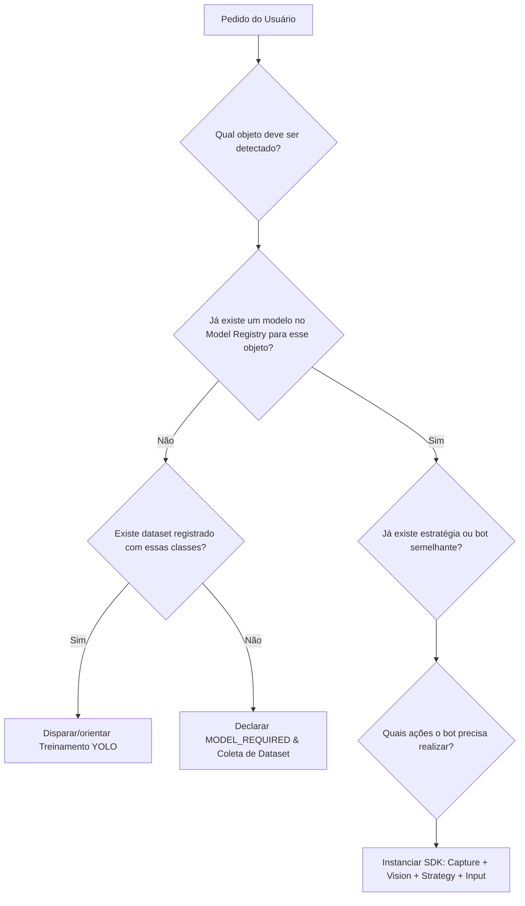

# Instruções para Agentes de Inteligência Artificial (AI_INSTRUCTIONS.md)

> [!IMPORTANT]
> **ESTE DOCUMENTO É A LEI SUPREMA PARA QUALQUER IA/AGENT OPERANDO NESTE PROJETO.**
> Sempre que um usuário pedir uma nova automação (ex.: *"Crie um bot para o jogo X que encontre o objeto Y e vá até ele"*), você deve seguir o protocolo abaixo com rigor absoluto.

---

## 1. Fluxo Mental Obrigatório da IA

Quando solicitada a criar ou modificar um bot, a IA deve responder internamente às seguintes 5 perguntas antes de escrever código:

### Regras Inegociáveis da IA:
1. **NÃO inventar modelos YOLO falsos**: Nunca crie arquivos `.pt` vazios, mocks com coordenadas fixas simuladas dizendo que é um detector neural, ou invente que o modelo reconhece classes que ele não possui nos metadados.
2. **Declarar `MODEL_REQUIRED`**: Se o usuário pedir para detectar *"ursinhos gigantes"* e não houver um modelo treinado nem dataset com essa classe, informe claramente:
   > *"Para esse objetivo, precisamos primeiro de um modelo de visão treinado. O fluxo requer coleta de imagens do jogo, anotação das classes e treinamento via TrainingManager do SDK."*
3. **NUNCA violar o Bot SDK**:
   - Nunca instancie `PIL.ImageGrab` ou `cv2.VideoCapture` dentro do bot. Use `sdk.bot_sdk.capture.CaptureEngine`.
   - Nunca chame bibliotecas de teclado (`pynput`, `pyautogui`, `ahk`) dentro da estratégia do bot. Use `sdk.bot_sdk.input.InputEngine`.
   - Nunca carregue pesos com PyTorch diretamente no bot. Use `sdk.bot_sdk.vision.VisionEngine`.
4. **Respeitar o Manifesto `bot.json`**: Todo bot vive em sua própria pasta e possui obrigatoriamente um `bot.json` validado pelo schema `schemas/bot-manifest.schema.json`.
5. **Atualização Automática de Catálogos**: Sempre que criar um bot, adicione sua entrada em:
   - `docs/bots/BOT_CATALOG.md`
   - `docs/bots/MODEL_CATALOG.md` (se novo modelo for registrado)
   - `docs/bots/DATASET_CATALOG.md` (se novo dataset for adicionado)
