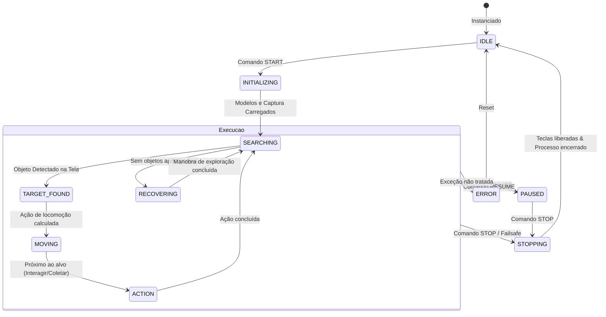

# Ciclo de Vida do Bot & Máquina de Estados (BOT_LIFECYCLE.md)

Este documento estabelece a máquina de estados oficial executada pelo `BotRuntime`.

---

## 1. Diagrama de Estados do Processo

---

## 2. Protocolo IPC (JSON Lines)

A comunicação entre a UI Desktop (Tauri) e o worker Python do bot ocorre estritamente por mensagens JSON delimitadas por quebras de linha (`\n`):

### Comandos de Entrada (stdin):
- `START`: `{"type": "START", "config": { ... }}`
- `STOP`: `{"type": "STOP"}`
- `PAUSE`: `{"type": "PAUSE"}`
- `RESUME`: `{"type": "RESUME"}`
- `CONFIG_UPDATE`: `{"type": "CONFIG_UPDATE", "config": { ... }}`

### Eventos de Saída (stdout):
- `status`: `{"type": "status", "state": "running"|"paused"|"stopped"|"error"}`
- `detection`: `{"type": "detection", "objects": [...], "fps_capture": 30.0, "fps_inference": 25.0}`
- `action`: `{"type": "action", "action": "move_to_coin", "keys": ["w"]}`
- `preview_frame`: `{"type": "preview_frame", "data": "data:image/jpeg;base64,..."}`
- `log`: `{"type": "log", "level": "info"|"vision"|"movement"|"warning"|"error", "message": "..."}`
