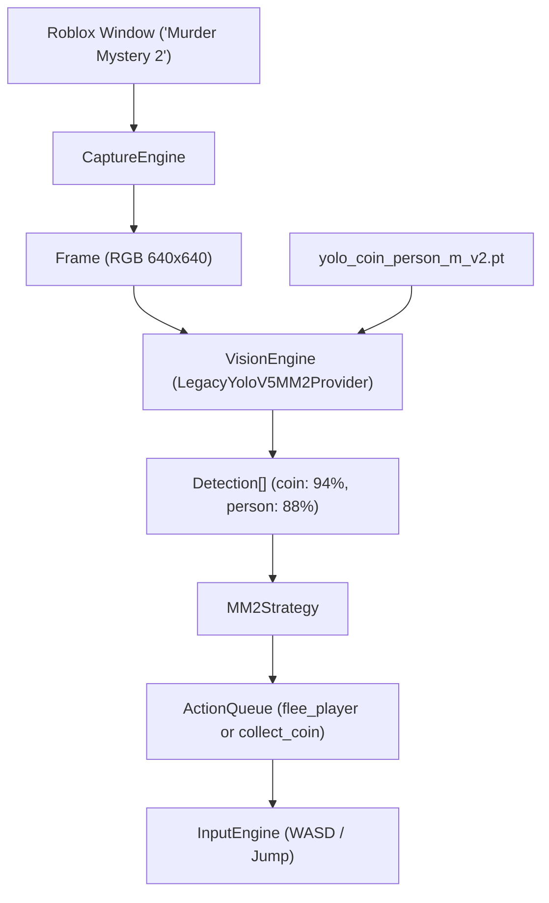

# Caso de Estudo Real: Roblox MM2 Coin Collector

Este exemplo documenta a integração real do robô de Murder Mystery 2 da plataforma.

---

## 1. Pipeline de Execução

---

## 2. Estratégia de Decisão
- Se `len(players) > 0`: calcula o centroide médio dos jogadores e caminha na direção oposta.
- Se `len(coins) > 0`: seleciona uma moeda detectada e aproxima o personagem usando vetores relativos de tela.
- Se nenhum objeto for detectado: dispara movimentos de busca aleatória para varrer a sala.
